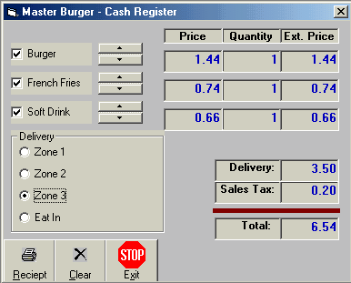



## Virtual Cash Register

### Description

This is a Virtual Cash Register, an example of how to use things such as scroll bars, arrays, option buttons, and a few other useful features.
 
### More Info
 

             |
---                |---
**Submitted On**   |2001-11-04 14:28:24
**By**             |[Dave Kramer](https://github.com/Planet-Source-Code/PSCIndex/blob/master/ByAuthor/dave-kramer.md)
**Level**          |Intermediate
**User Rating**    |4.2 (21 globes from 5 users)
**Compatibility**  |VB 6\.0
**Category**       |[Complete Applications](https://github.com/Planet-Source-Code/PSCIndex/blob/master/ByCategory/complete-applications__1-27.md)
**World**          |[Visual Basic](https://github.com/Planet-Source-Code/PSCIndex/blob/master/ByWorld/visual-basic.md)
**Archive File**   |[Virtual\_Ca666373292002\.zip](https://github.com/Planet-Source-Code/dave-kramer-virtual-cash-register__1-33202/archive/master.zip)

